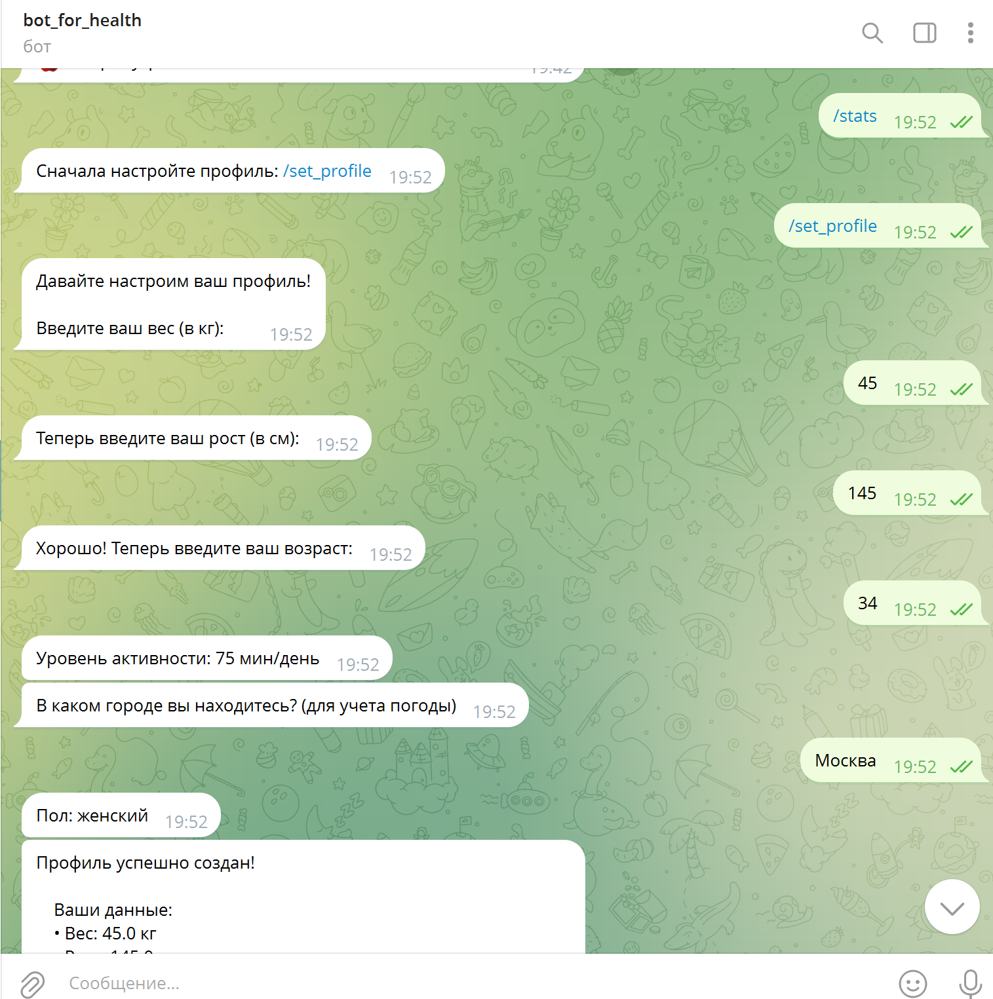
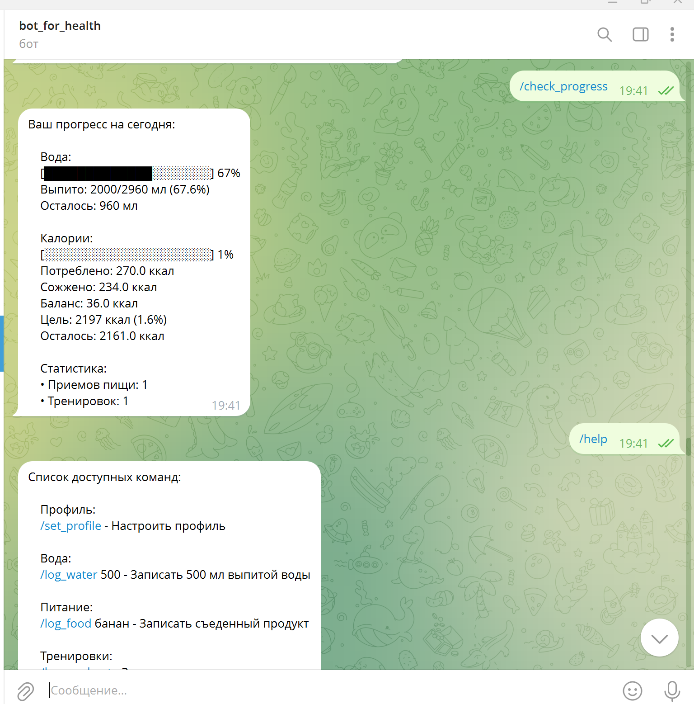
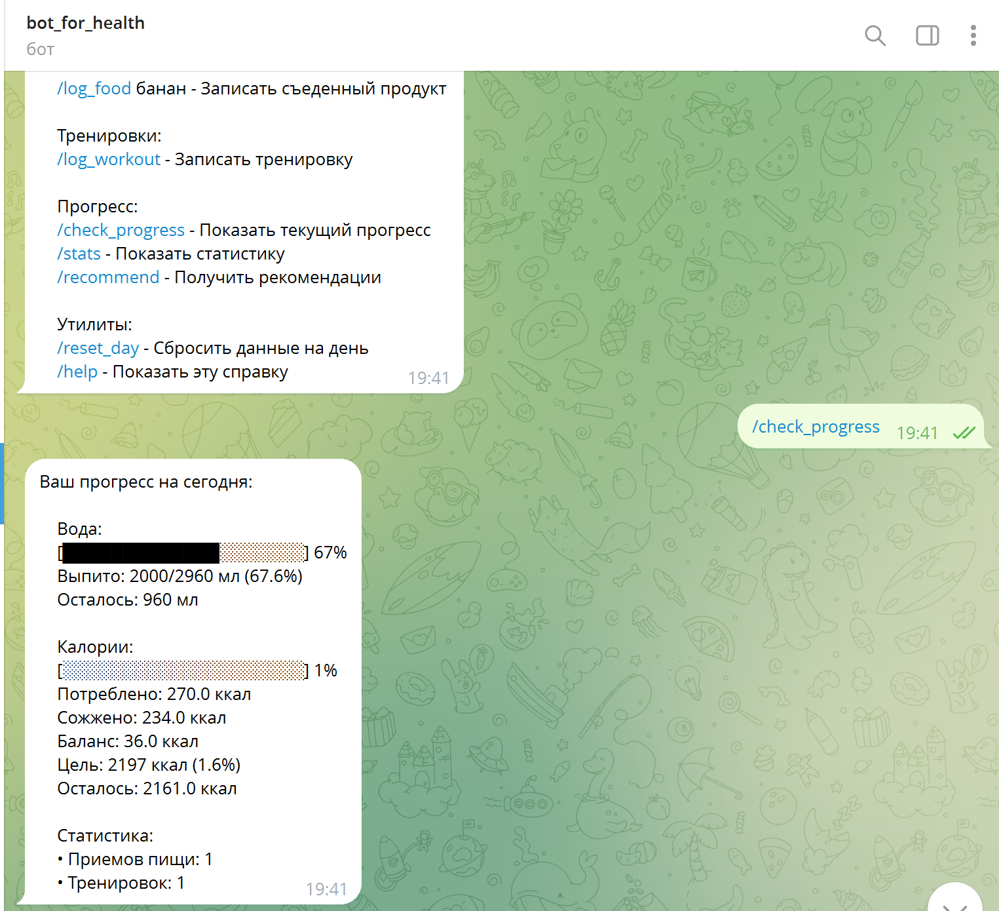
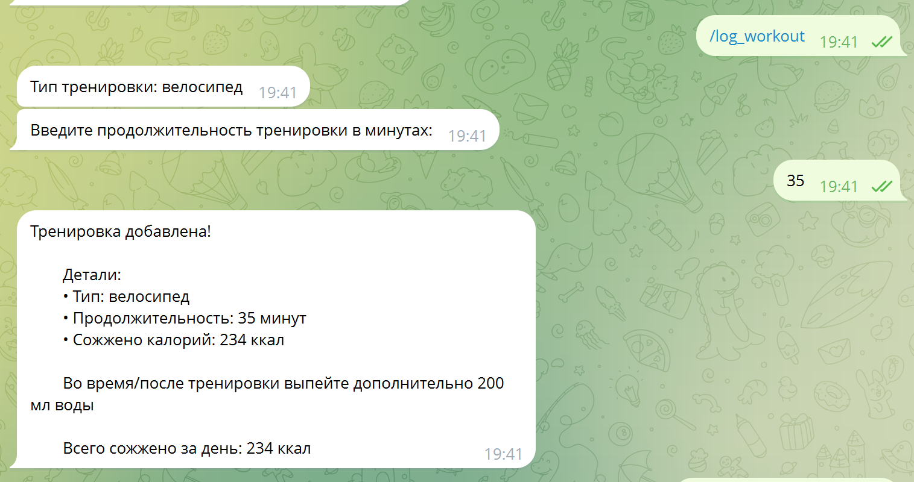
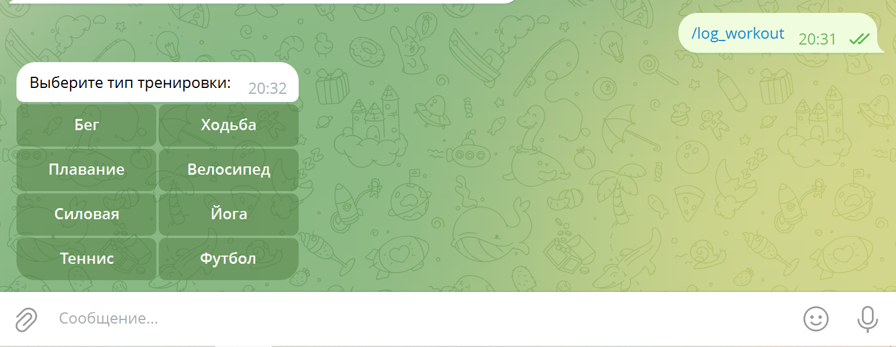
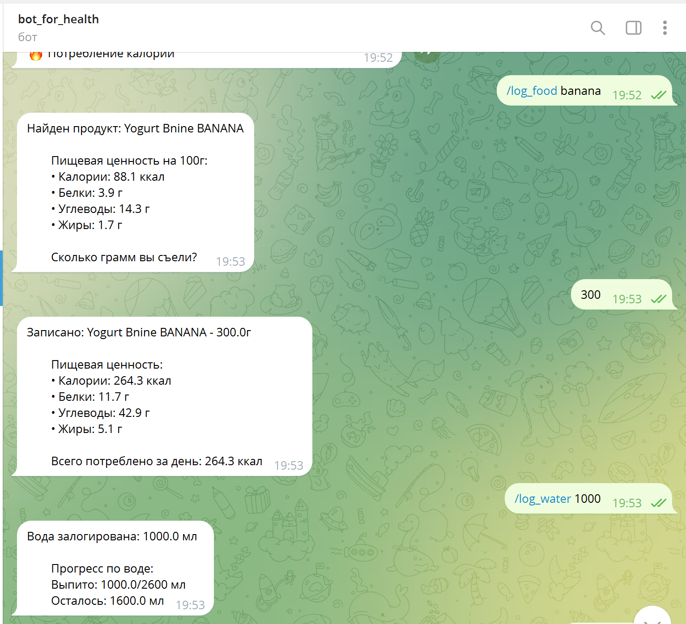
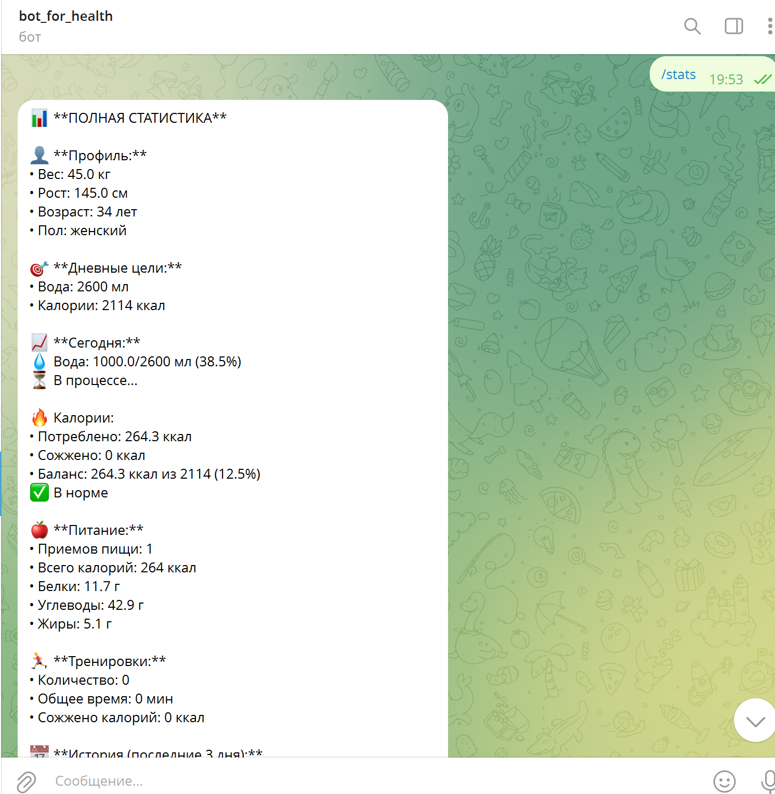
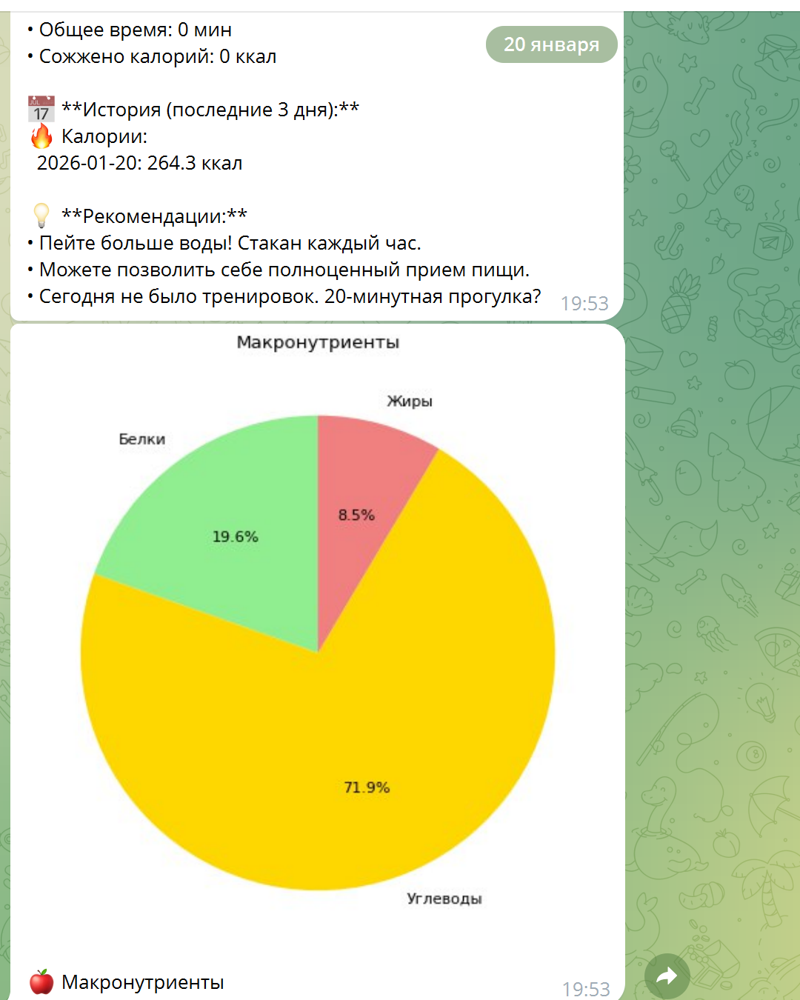
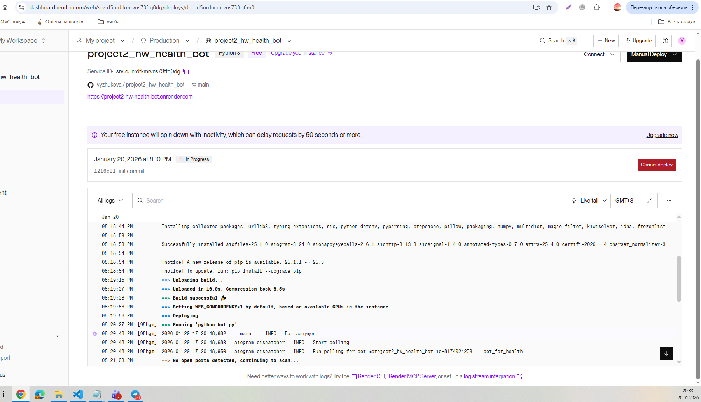

# project2_hw_health_bot
# Проект для дз2 по питону - бот для здоровья

## Список доступных команд:

    Профиль:
    /set_profile - Настроить профиль

    Вода:
    /log_water 500 - Записать 500 мл выпитой воды

    Питание:
    /log_food банан - Записать съеденный продукт

    Тренировки:
    /log_workout - Записать тренировку

    Прогресс:
    /check_progress - Показать текущий прогресс
    /stats - Показать статистику
    /recommend - Получить рекомендации

    Утилиты:
    /reset_day - Сбросить данные на день
    /help - Показать эту справку

## Настройки
Нужно указывать в файле .env

# Доказательства работы 

# Доказательство деплоя 
